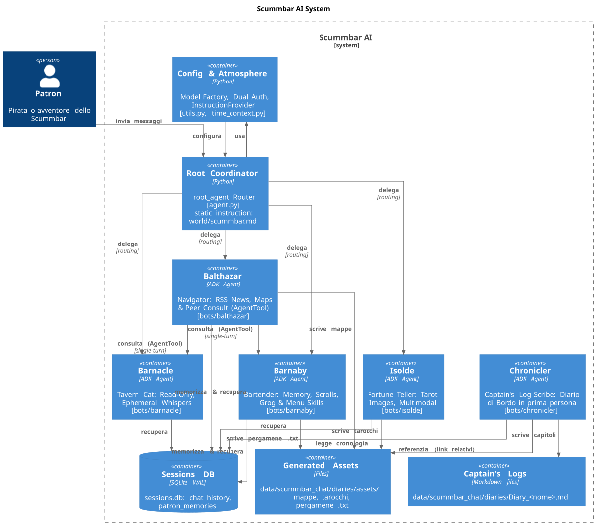
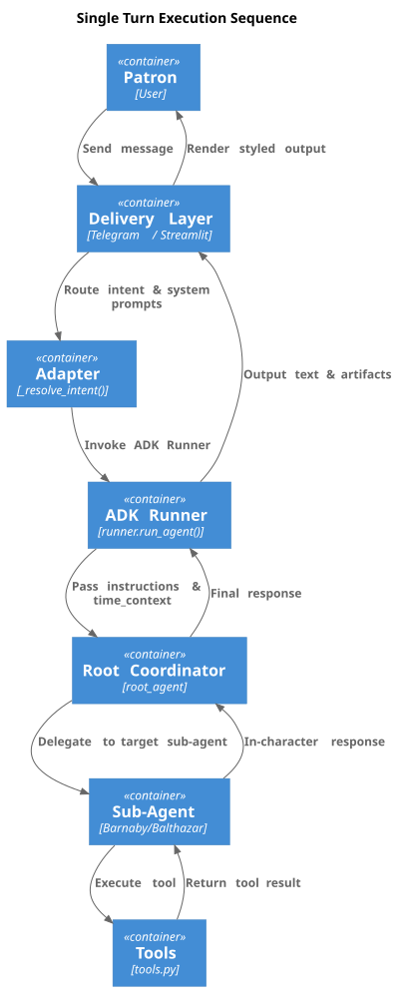
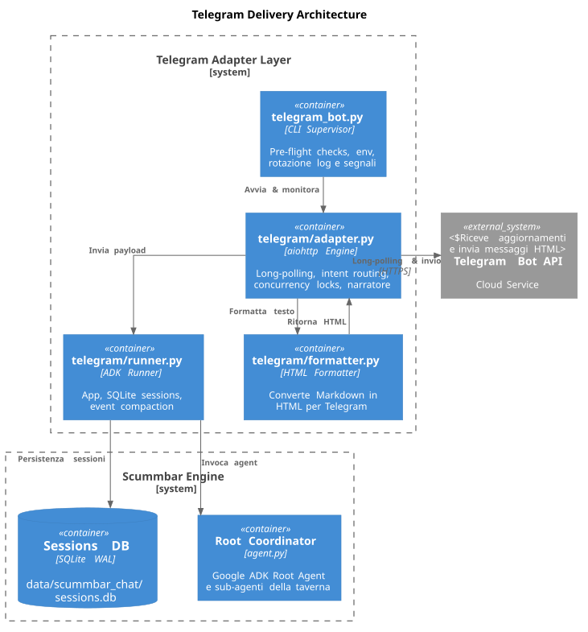
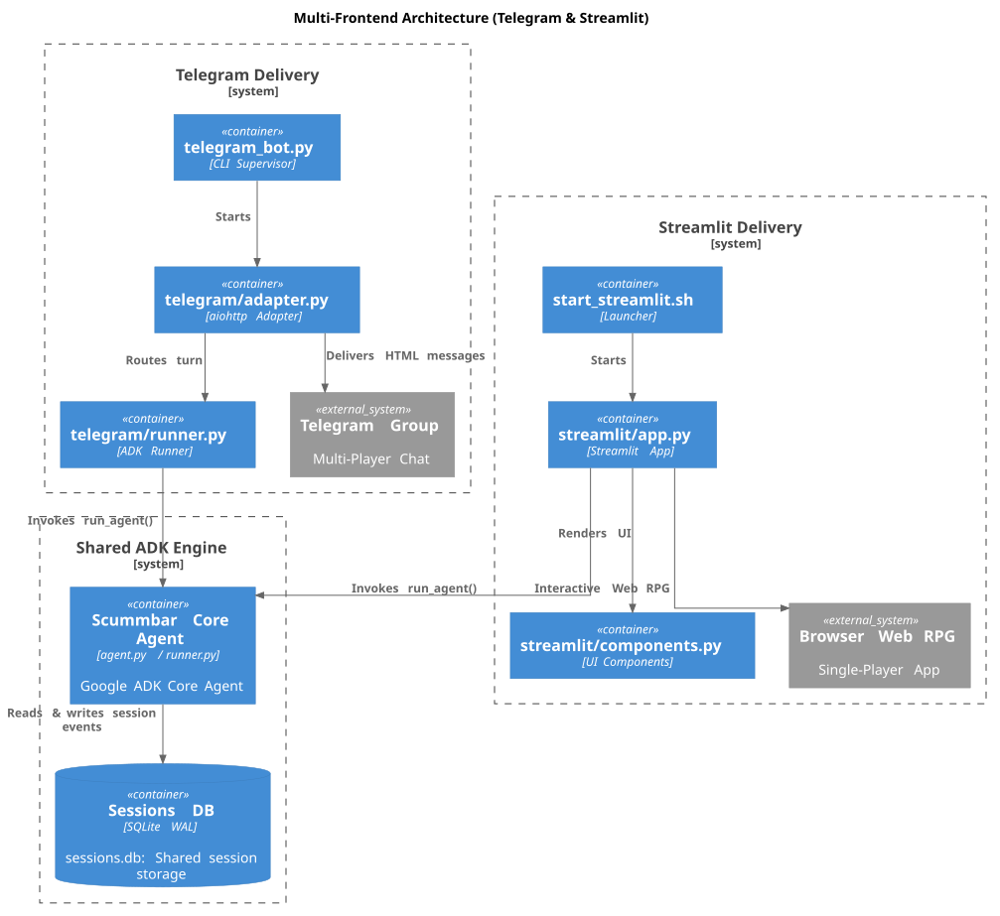
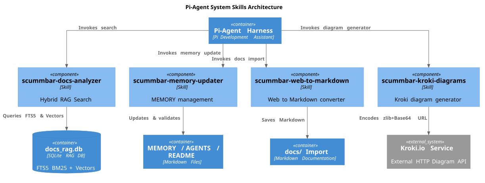

# 🍺 ScummBar AI — A Collaborative Multi-Agent Study Project


> *"Where sabers rest, stories float, and agents run the bar."*

**Scummbar AI** is an open-source, hands-on **study repository** that teaches how to design, orchestrate, and operate a complex **multi-agent conversational application** using **Google Agent Development Kit (ADK)**, **Gemini** and **DeepSeek**, delivered through **Telegram** (multi-player group chat) and a **Streamlit web RPG** (single-player adventure).

The repository is intentionally structured **didactically**: every architectural choice, every file, and every integration is documented so you can understand *why* the system is built this way — not just *what* it does.

---

## 🗺️ Table of Contents

- [🍺 ScummBar AI — A Collaborative Multi-Agent Study Project](#-scummbar-ai--a-collaborative-multi-agent-study-project)
  - [🗺️ Table of Contents](#-table-of-contents)
  - [🎯 Project Purpose](#-project-purpose)
  - [📖 The Story \& The Characters](#-the-story--the-characters)
  - [🚀 Quick Start (Run First, Learn Later)](#-quick-start-run-first-learn-later)
    - [1. Prerequisites](#1-prerequisites)
    - [2. Installation](#2-installation)
    - [3. `.env` Configuration](#3-env-configuration)
    - [4. Running the Applications](#4-running-the-applications)
  - [🏗️ The ADK Core: Architecture \& How It Works](#-the-adk-core-architecture--how-it-works)
    - [4.1 Core Overview Diagram](#41-core-overview-diagram)
    - [4.2 Multi-Agent Coordination (Router-Delegate)](#42-multi-agent-coordination-router-delegate)
    - [4.3 Agent Configuration](#43-agent-configuration)
    - [4.4 ADK Skills (Auto-Discovery)](#44-adk-skills-auto-discovery)
    - [4.5 ADK Function Tools](#45-adk-function-tools)
    - [4.6 Time Management (Real Atmosphere)](#46-time-management-real-atmosphere)
    - [4.7 World Context \& Narration Rules](#47-world-context--narration-rules)
    - [4.8 The Captain's Log (Tavern Journal)](#48-the-captains-log-tavern-journal)
    - [4.9 Model Factory \& Dual Authentication](#49-model-factory--dual-authentication)
    - [4.10 Sessions, Compaction \& Context Caching](#410-sessions-compaction--context-caching)
  - [📡 Telegram Frontend (Multi-Player)](#-telegram-frontend-multi-player)
    - [5.1 Telegram Delivery Architecture](#51-telegram-delivery-architecture)
    - [5.2 Semantic Routing](#52-semantic-routing)
    - [5.3 Concurrency, Ephemeral \& Session Pruning](#53-concurrency-ephemeral--session-pruning)
    - [5.4 HTML Message Formatting](#54-html-message-formatting)
  - [🎮 Streamlit Frontend (Single-Player RPG)](#-streamlit-frontend-single-player-rpg)
    - [6.1 Architecture \& Concept](#61-architecture--concept)
    - [6.2 Key Features](#62-key-features)
      - [A. Mandatory "Patron Name" Field](#a-mandatory-patron-name-field)
      - [B. Automatic Semantic Intent Routing](#b-automatic-semantic-intent-routing)
      - [C. Automatic History Restoration](#c-automatic-history-restoration)
      - [D. Narratore Synchronization](#d-narratore-synchronization)
      - [E. Integrated Captain's Log](#e-integrated-captains-log)
      - [F. Segmented Control Navigation](#f-segmented-control-navigation)
      - [G. Multi-Process Concurrency \& WAL](#g-multi-process-concurrency--wal)
    - [6.3 Narrative \& Action Styling (3 Tiers)](#63-narrative--action-styling-3-tiers)
  - [🤖 Pi-Agent: AI-Assisted Development \& System Skills](#-pi-agent-ai-assisted-development--system-skills)
    - [7.1 What is a Pi-Agent Skill (Progressive Disclosure)](#71-what-is-a-pi-agent-skill-progressive-disclosure)
    - [7.2 scummbar-docs-analyzer (Hybrid RAG)](#72-scummbar-docs-analyzer-hybrid-rag)
    - [7.3 scummbar-memory-updater (MEMORY/README/AGENTS Management)](#73-scummbar-memory-updater-memoryreadmeagents-management)
    - [7.4 scummbar-web-to-markdown (Docs Import)](#74-scummbar-web-to-markdown-docs-import)
    - [7.5 scummbar-kroki-diagrams (Kroki Diagram Generator)](#75-scummbar-kroki-diagrams-kroki-diagram-generator)
    - [7.6 How to Use the Autopilot](#76-how-to-use-the-autopilot)
  - [🧭 Project Structure](#-project-structure)
  - [⚙️ Environment Configuration (.env)](#-environment-configuration-env)

---

## 🎯 Project Purpose

Scummbar AI is a **didactic laboratory** to explore the **Google ADK** ecosystem and multi-agent architectures in depth — without sacrificing a **fun and immersive** user experience.

The main goals are:

| Goal | How It Is Addressed |
|------|---------------------|
| **Multi-Agent Orchestration** | A `root_agent` coordinator that delegates to 4 specialized sub-agents (Router-Delegate pattern) |
| **Tool Calling** | ADK Function Tools for persistent memory, artifacts, images, and live RSS feeds |
| **Modular Skills** | ADK Skill auto-discovery: adding a capability = creating a `SKILL.md` folder, zero code |
| **Dynamic Prompting** | An `InstructionProvider` that refreshes the tavern atmosphere on every turn |
| **Multi-Model** | Switch between Gemini and DeepSeek by changing **a single line** in `.env` |
| **Isolated Dual Auth** | API Key ↔ Vertex AI Service Account, with fully isolated image auth |
| **Multi-Frontend** | Same shared ADK core, two frontends: **Telegram** (multi-player group) and **Streamlit** (single-player RPG) |
| **Persistence & Compaction** | Shared SQLite WAL + automatic LLM compaction of long sessions |
| **Persistent Storytelling** | The **Captain's Log** turns the chat into a first-person tale, updated incrementally |
| **AI-Assisted Development** | A **Pi-Agent Skills** system with a local hybrid RAG engine for autonomous documentation |

---

## 📖 The Story & The Characters

The **Scummbar** is a legendary Caribbean pirate tavern. It is a shared multi-agent environment where AI-powered characters live, listen, and interact with patrons in real time.

| Character | Role | Didactic Purpose | Personality |
|-----------|------|------------------|-------------|
| 🍺 **Barnaby** | Bartender | Tool Calling (read/write memory, text artifacts), Skills Auto-Discovery | Empathetic, quiet, knows every pirate's secret, mixes unforgettable custom grogs |
| 🐱 **Barnacle** | Tavern Cat | Shared **read-only** memory, Telegram **ephemeral** messages (whispers) | Crotchety, speaks rarely, sleeps on ammo crates |
| 🔮 **Isolde** | Fortune Teller | Independent multi-auth, multimodal image generation (Gemini Flash Image + PIL fallback) | Cryptic, majestic, sits in the Shadow Corner |
| 🧭 **Balthazar** | Navigator & Cartographer | Live RSS feeds + comedic translation, text artifacts (portolans & charts), Captain's Log | Eccentric, theatrically solemn, turns real news into maritime lore |

---

## 🚀 Quick Start (Run First, Learn Later)

### 1. Prerequisites
- Python 3.11+
- **Astral `uv`** (`brew install uv` or `curl -LsSf https://astral.sh/uv/install.sh`)
- A Google Gemini API Key (Google AI Studio) **or** a Vertex AI Service Account
- A Telegram Bot Token from [@BotFather](https://t.me/botfather) (optional, Telegram only)

### 2. Installation
```bash
git clone https://github.com/goldfix/ScummBarAI.git
cd ScummBarAI

# Initialize and create the virtual environment
bash py_env.sh init_py

# Activate the environment
source py-env/bin/activate   # or: source py_env.sh active
```

### 3. `.env` Configuration
Create the file `src/scummbar_chat/.env` (see [the Environment Configuration section](#-environment-configuration-env) for the full reference).

### 4. Running the Applications

| Frontend | Command | Description |
|----------|---------|-------------|
| ADK Web | `./start.sh` | ADK Web UI with SQLite persistence |
| Telegram | `python telegram_bot.py --debug` | Telegram bot for groups |
| Streamlit | `./start_streamlit.sh` | Single-player RPG on `http://localhost:8501` |

---

## 🏗️ The ADK Core: Architecture & How It Works

The heart of the application lives in `src/scummbar_chat/`. Everything else (Telegram, Streamlit, Pi-Agent skills) is a **delivery layer** or **support** around this nucleus.

### 4.1 Core Overview Diagram



**Logical flow of a single turn:**



### 4.2 Multi-Agent Coordination (Router-Delegate)

Instead of a single monolithic prompt, Scummbar uses the ADK **Hierarchical Router-Delegate** pattern:

- **`root_agent`** (`agent.py`): a coordinator `Agent` that **never answers directly** — it reads the routing prefix and delegates to the correct sub-agent.
- **4 sub-agents** registered in `sub_agents=[barnaby_agent, barnacle_agent, isolde_agent, balthazar_agent]`.

Routing happens at two priority levels (see [5.2 Semantic Routing](#52-semantic-routing)):
1. **Explicit @mention** (e.g. `@balthazar`) → always wins
2. **Keyword matching** (e.g. `grog` → Barnaby, `tarocchi` → Isolde)

Once resolved, the router prepends `[Risponde NOME]` to the text, which the coordinator interprets to delegate.

### 4.3 Agent Configuration

Each agent lives in `bots/<name>/` with two files: `agent.py` (ADK config) and `persona.md` (Italian, channel-agnostic prompt).

| Agent | Model | Skills | Tools | Read-Only? |
|-------|-------|--------|-------|------------|
| 🍺 **barnaby** | `MODEL` | ✅ grog + menu (auto-discovery) | recall, memorize, write_secret_scroll, **update_tavern_diary_tool** | No |
| 🐱 **barnacle** | `MODEL` | ✅ grog + menu | recall (smell/read only) | **Yes** — cannot write memory |
| 🔮 **isolde** | `MODEL` | — (no skills) | recall, draw_tarot_card | No |
| 🧭 **balthazar** | `MODEL` | ✅ grog + menu | recall, memorize, write_secret_scroll, fetch_news_feed, **update_tavern_diary_tool** | No |

**Base agent configuration (Barnaby example):**
```python
barnaby_agent = Agent(
    name="barnaby",
    model=MODEL,
    description="Barnaby, il barista dello Scummbar.",
    instruction=_PERSONA,                        # persona.md
    generate_content_config=THINKING_CONFIG,     # thinking_level=LOW
    retry_config=DEFAULT_RETRY_CONFIG,           # retry with backoff
    tools=[_barnaby_toolset, recall_patron_tool, memorize_patron_tool,
           update_tavern_diary_tool, write_secret_scroll_tool],
)
```

### 4.4 ADK Skills (Auto-Discovery)

Skills live in `src/scummbar_chat/skills/` as folders containing `SKILL.md`:

```
skills/
├── grog/     → SKILL.md + references/  (dynamic grog preparation)
└── menu/     → SKILL.md                (two-level galley menu)
```

**How auto-discovery works**: `utils.load_all_skills()` scans the `skills/` folder at runtime and instantiates a `SkillToolset` for every `SKILL.md` found. **Adding a new skill = creating a folder, zero Python code.**

Skills are **self-contained**: all content (rules, examples, references) lives inside `SKILL.md`, loaded on demand by the model.

### 4.5 ADK Function Tools

All tools are defined in `tools.py` and wrapped with `FunctionTool(...)`. They receive the user identity exclusively from `tool_context.user_id` (never from the LLM, for safety).

| Tool | Function | Description |
|------|----------|-------------|
| `recall_patron_memory` | Memory read | Retrieves the patron's traits and summaries from `patron_memories` (SQLite) |
| `memorize_patron_chat` | Memory write | Updates stable traits (max 10) and chat summary (max 300 chars) |
| `write_secret_scroll` | Text artifacts | Generates scrolls/recipes/portolans `.txt` via `InMemoryArtifactService` |
| `draw_tarot_card` | Multimodal images | Generates tarot cards with `gemini-3.1-flash-lite-image` (isolated `IMAGE_*` auth), PIL fallback, PNG/JPEG detection via byte headers |
| `fetch_news_feed` | Live RSS feeds | ANSA + HDBlog, 3 categories (IT politics, world, tech), comedic translation with HTML links |
| `update_tavern_diary_tool` | Captain's Log | Updates the patron's diary using the real `tool_context.session.id` and filtering by `user_id` (avoids mixing patrons in a group) |

### 4.6 Time Management (Real Atmosphere)

`time_context.py` maps the system clock into **6 Caribbean moments of the day**:

| Time | Moment | Atmosphere |
|------|--------|------------|
| 07–09 | 🌅 Dawn | Bar opens, silence, first pink light |
| 09–12 | ☀️ Morning | The bar wakes up, first serious customers |
| 12–14 | 🍺 Noon | Peak activity, crowd at the counter |
| 14–16 | 😴 Afternoon | Sleepy post-lunch calm |
| 16–18 | 🌇 Sunset | Golden light, lanterns lit |
| 18–∞ | 🌙 Night | The bar never closes, night pirates |

**How it is used**: `agent.py` exposes `_time_instruction_provider(context)` — an ADK **`InstructionProvider`** bound to `global_instruction`. On **every model turn**, the atmospheric description of the current moment is regenerated and injected into the context. This is cache-friendly for Gemini and guarantees the bots always know whether it is dawn or deep night.

### 4.7 World Context & Narration Rules

`world/scummbar.md` is the tavern's **master prompt**: geography, ambient rules, character relationships, and the **Narratore rules** (environmental description injection every 3 turns).

It is loaded with `load_md()` and passed as `static_instruction` to the `root_agent`, so every sub-agent inherits the context without duplicating it.

**Key rule**: all `.md` files are **channel-agnostic** — no references to Telegram or Streamlit. Visual rendering is exclusively the frontends' responsibility.

### 4.8 The Captain's Log (Tavern Journal)

`diary.py` turns the conversation into a **first-person tale** ("I"), as if the patron himself were writing down his deeds.

| Aspect | Detail |
|--------|--------|
| **File** | `data/scummbar_chat/diaries/Diary_<Pirate_Name>.md` (one per patron) |
| **Tracking** | HTML comment at the top of the file: `<!-- DIARY_METADATA: {"last_saved_index": N} -->` |
| **Incremental update** | Reads `last_saved_index`, extracts only new messages (`messages[last_saved_index:]`), generates a chapter, appends it |
| **Idempotency** | No new messages → returns without consuming tokens |
| **Style** | Dedicated prompt: first person, Caribbean adventure, discursive, rich in detail |
| **Automatic trigger** | In Streamlit, every 10 total session messages (with confirmation toast) |
| **Manual trigger** | "🔄 Compila / Aggiorna Diario ORA" button in the Captain's Log tab |
| **ADK tool** | `update_tavern_diary_tool` (Barnaby and Balthazar can update it in-character) |
| **Download** | "📥 Scarica Diario (.md)" button |
| **Dual-provider** | Generation uses `_build_model_instance(COMPACTION_MODEL)` → works with Gemini and DeepSeek |

### 4.9 Model Factory & Dual Authentication

`utils.py` centralizes model creation:

- **`_build_model_instance(model_name, is_main_model)`** → returns `Gemini` (native ADK) if the name has no prefix, `LiteLlm` (DeepSeek) if it starts with `deepseek/`. For the main model it enables `thinking` + `reasoning_effort=high`.
- **`get_gemini_client_kwargs(prefix="")`** → parameterizes authentication between:
  - **API Key** (Google AI Studio): forces `vertexai=False`, clears `project/location`
  - **Vertex AI / Service Account**: loads credentials in RAM as a `Credentials` object (without mutating `os.environ`, thread-safe)
  - With the `IMAGE_` prefix it fully isolates image-generation authentication

**Key rules**: no `temperature`/`top_p`/`top_k` for Gemini 3.x models; `thinking_level=LOW` (Gemini) / `reasoning_effort=high` (DeepSeek); `include_thoughts=False` with `thought` part filtering.

### 4.10 Sessions, Compaction & Context Caching

| Mechanism | Configuration | Detail |
|-----------|---------------|--------|
| **Persistence** | `DatabaseSessionService` → `data/scummbar_chat/sessions.db` | WAL mode + `busy_timeout=10000` for multi-frontend concurrency |
| **Compaction** | `EventsCompactionConfig` + `LlmEventSummarizer` | Every `COMPACTION_INTERVAL=30` events, summarizes the past with `COMPACTION_MODEL`, keeps `COMPACTION_OVERLAP=2` events verbatim |
| **Context Caching** | `ContextCacheConfig` (Gemini 2.0+) | `min_tokens=2048`, `ttl=600s`, `cache_intervals=5`; automatically skipped for DeepSeek (server-side KV caching) |
| **Artifacts** | `InMemoryArtifactService` | Scrolls, portolans, and images saved into the ADK session |
| **Session Pruning** | `purge_old_sessions(hours=24)` + hourly cron | Keeps the DB clean by deleting events older than 24h |

---

## 📡 Telegram Frontend (Multi-Player)

Telegram provides the **multi-player** experience: a shared group where the 4 bots respond in real time.

### 5.1 Telegram Delivery Architecture



| File | Role |
|------|------|
| `telegram_bot.py` | Pre-flight env checks (Gemini/DeepSeek auth), rotating logs (`bot.log`, `errors.log`), signal trapping, delegates to `adapter.main()` |
| `telegram/adapter.py` | Long-polling engine via `aiohttp` (no extra libraries). DM redirect to the group, routing, concurrency locks, Narratore injection every 3 messages, artifact upload via `sendDocument`/`sendPhoto`, Barnacle's ephemeral whispers, pruning cron |
| `telegram/formatter.py` | Converts raw markdown to Telegram-safe HTML: speech → text, `*action*` → `<i>action</i>`, `_narration_` → `<blockquote><i>narration</i></blockquote>`; escapes `<`, `>`, `&` |
| `telegram/runner.py` | Initializes `App(root_agent)` with `DatabaseSessionService`, `EventsCompactionConfig`, `ContextCacheConfig`, `InMemoryArtifactService`. Exposes `run_agent()` and `purge_old_sessions()` |

### 5.2 Semantic Routing

The `_resolve_intent()` function applies two priority levels:

1. **Explicit @mention** → `@barnaby`, `@barnacle`, `@isolde`, `@balthazar` (always wins)
2. **Keyword matching** on `_INTENT_MAP` (e.g. `grog`/`birra`/`ordinare` → Barnaby; `tarocchi`/`carte`/`predizione` → Isolde; `mappa`/`rotta`/`bussola` → Balthazar; `gatto`/`fusa` → Barnacle)

### 5.3 Concurrency, Ephemeral & Session Pruning

- **Per-bot locks**: `asyncio.Lock` with a **15s timeout** (`asyncio.wait_for`) → if a bot is busy, the user receives "è occupato" instead of waiting forever.
- **Barnacle ephemeral**: the cat's messages use `sendMessage` with ephemeral/reply mode if the bot is admin in the group; public fallback with a `🐱` note.
- **Pruning**: `_session_cleaner_cron()` every hour removes events older than 24 hours (direct DELETE on the ADK `events` table, wrapped in try/except).

### 5.4 HTML Message Formatting

The `format_response()` pipeline applies a 3-tier hierarchy:

| Element | Source pattern | Telegram HTML output |
|---------|---------------|----------------------|
| **Environmental narration** | full lines `_text_` | `<blockquote><i>text</i></blockquote>` |
| **Character actions** | inline `*action*` | `<i>action</i>` |
| **Spoken dialogue** | plain text | unstyled text |

---

## 🎮 Streamlit Frontend (Single-Player RPG)

While Telegram is a real-time group chat, the **Streamlit Web App** (`src/scummbar_chat/streamlit/`) turns the Scummbar into a **single-player narrative RPG**.

### 6.1 Architecture & Concept



**Zero business-logic duplication**: `app.py` uses the same `run_agent()` as Telegram and the same routing functions (`_resolve_intent()`).

| File | Role |
|------|------|
| `streamlit/app.py` | Entry point. Manages session, automatic routing, Narratore trigger, history restoration, Chat tab + Captain's Log tab, automatic diary trigger every 10 messages |
| `streamlit/components.py` | Avatars, 3-tier narrative formatting, artifact rendering, sidebar (mandatory patron name, character legend, game management) |
| `start_streamlit.sh` | `streamlit run src/scummbar_chat/streamlit/app.py` |

### 6.2 Key Features

#### A. Mandatory "Patron Name" Field
On startup the field is **empty** and the chat is **locked** (`st.chat_input(disabled=True)`) with a pirate warning: the user must enter their name to enter.

#### B. Automatic Semantic Intent Routing
Same engine as Telegram: `maga`/`veggente` → Isolde, `navigatore`/`mappe` → Balthazar, `gatto`/`micio` → Barnacle, `barista`/`grog` → Barnaby.

#### C. Automatic History Restoration
When the player enters their name:
1. Stable `user_id` computed via `sha256(patron_name)`
2. Deterministic `session_id` = `st_session_{user_id}`
3. `load_session_chat_history()` queries the SQLite `events` table and **instantly restores** the pirate's entire past story

#### D. Narratore Synchronization
`narrator_counter`: every **3 turns** it appends `[NOTA DI SISTEMA: È il momento del Narratore...]` to the prompt, like in Telegram.

#### E. Integrated Captain's Log
"📜 Captain's Log" view with: registered/total message stats, **"🔄 Compila / Aggiorna Diario ORA"** button, **"📥 Scarica Diario (.md)"** button, live Markdown preview, and automatic trigger every 10 messages with confirmation toast.

#### F. Segmented Control Navigation
The frontend uses `st.segmented_control` (not `st.tabs`) to alternate between **Chat Tavern** ↔ **Captain's Log**. This keeps `st.chat_input` at top level, preserving the **sticky bottom anchoring** (known `st.chat_input`-inside-`st.tabs` bug).

#### G. Multi-Process Concurrency & WAL
Telegram and Streamlit share the same `sessions.db`. To avoid `database is locked`:
- `PRAGMA journal_mode=WAL;`
- `PRAGMA busy_timeout=10000;` + `sqlite3.connect(timeout=10.0)`

### 6.3 Narrative & Action Styling (3 Tiers)

`format_streamlit_narrative()` applies a 3-tier visual hierarchy:

| Element | Source pattern | Streamlit visual output |
|---------|---------------|-------------------------|
| **Environmental narration** | full lines `_text_` | Italic **between guillemets** `«...»` on a **light gray box** (`#e9ecef`) |
| **Character actions** | inline `*action*` | Italic between guillemets `«...»` on a **light gray badge** |
| **Spoken dialogue** | plain text | **Plain sans-serif text** (maximum readability) |

---

## 🤖 Pi-Agent: AI-Assisted Development & System Skills

This repository is designed to be developed, refactored, and maintained **in collaboration with an AI assistant (Pi-Agent)**. To this end, an autonomous **Agent Skills** system is configured directly in the codebase.



### 7.1 What is a Pi-Agent Skill (Progressive Disclosure)

A Pi-Agent skill is a self-contained package in `.agents/skills/`, consisting of `SKILL.md` (full instructions) + optional Python scripts. Pi-Agent scans this folder at startup and learns the capabilities from the **description**; the full instructions are loaded **on-demand** when the skill is invoked.

This implements **Progressive Disclosure**: it keeps the AI's context window clean, saving tokens and improving reasoning focus.

### 7.2 scummbar-docs-analyzer (Hybrid RAG)

| Aspect | Detail |
|--------|--------|
| **Purpose** | Semantic + keyword search across **897 text documents** in `docs/` (Markdown, AsciiDoc, YAML, source code) |
| **Engine** | Local hybrid RAG: **FTS5 BM25** + **Vector Cosine Similarity** with `sqlite-vec` |
| **Embeddings** | Google `gemini-embedding-2` (768 dimensions) |
| **Fusion** | **Reciprocal Rank Fusion (RRF)** between the two rankings |
| **Cleanup** | The indexer compares DB vs disk and **automatically removes orphan documents** |
| **DB** | `.agents/skills/scummbar-docs-analyzer/data/docs_rag.db` (897 docs, 14,881 chunks) |

```bash
# Hybrid search (semantic + keyword)
PYTHONPATH=.agents/skills/scummbar-docs-analyzer python3 \
  .agents/skills/scummbar-docs-analyzer/rag/search.py "context compaction" --top_k 5

# Incremental re-indexing after adding new docs
PYTHONPATH=.agents/skills/scummbar-docs-analyzer python3 \
  .agents/skills/scummbar-docs-analyzer/rag/indexer.py
```

### 7.3 scummbar-memory-updater (MEMORY/README/AGENTS Management)

| Aspect | Detail |
|--------|--------|
| **Purpose** | Keep `MEMORY.md`, `README.md`, and `AGENTS.md` in sync |
| **Rules** | Standardizes how to document: session logs, roadmap, architectural decisions |
| **Validator** | Automatic Python script that verifies no Markdown code block is left open (balanced fence markers) |
| **Key rule** | Pure documentation additions (docs imports) do **not** auto-update `MEMORY.md` |

### 7.4 scummbar-web-to-markdown (Docs Import)

| Aspect | Detail |
|--------|--------|
| **Purpose** | Convert web pages into clean Markdown inside `docs/` |
| **Pipeline** | `beautifulsoup4` + `html2text` |
| **Extras** | Automatic updates, relative→absolute link resolution, UTF-8 emoji preservation, overwrite protection |
| **Post-conversion** | Automatic trigger of the RAG indexer to update the vector database |

### 7.5 scummbar-kroki-diagrams (Kroki Diagram Generator)

| Aspect | Detail |
|--------|--------|
| **Purpose** | Generate vector diagrams and infographics via Kroki.io |
| **Encoder** | zlib deflate (level 9) + Base64 URL-safe encoding |
| **Default Style** | **C4-PlantUML** (`c4plantuml`) for architectural C4 diagrams |
| **Supported Types** | Excalidraw, Mermaid, PlantUML, Graphviz/DOT, D2, BPMN, BlockDiag, etc. |
| **CLI Script** | `.agents/skills/scummbar-kroki-diagrams/scripts/kroki_generator.py` |
| **SVG Localization** | `--localize` downloads remote Kroki SVGs into `assets/` and rewrites Markdown links to local files (offline-ready) |
| **Target** | Used by Pi-Agent for documentation & README diagrams (not in runtime ADK app) |

### 7.6 How to Use the Autopilot

```bash
# 1. Search the documentation (hybrid RAG FTS5 + Cosine)
PYTHONPATH=.agents/skills/scummbar-docs-analyzer python3 \
  .agents/skills/scummbar-docs-analyzer/rag/search.py "agent evaluation" --top_k 5

# 2. Convert a web page to Markdown and index it into the RAG
python3 .agents/skills/scummbar-web-to-markdown/scripts/convert.py \
  "https://adk.dev/evaluate/" "docs/google-api/"
PYTHONPATH=.agents/skills/scummbar-docs-analyzer python3 \
  .agents/skills/scummbar-docs-analyzer/rag/indexer.py

# 3. Generate a C4-PlantUML diagram (default) and localize it as local SVG in assets/
python3 .agents/skills/scummbar-kroki-diagrams/scripts/kroki_generator.py \
  "Scummbar System\nBarnaby Bartender" --markdown
python3 .agents/skills/scummbar-kroki-diagrams/scripts/kroki_generator.py --localize README.md

# 4. Update memory, roadmap, and check fence-marker health
/skill:scummbar-memory-updater
```

---

## 🧭 Project Structure

```
scummbar/
├── .agents/skills/                 # 🤖 Pi-Agent system skills
│   ├── scummbar-docs-analyzer/     #    Hybrid RAG (FTS5 + sqlite-vec + gemini-embedding-2)
│   ├── scummbar-kroki-diagrams/    #    Kroki diagram generator (C4-PlantUML, Excalidraw, Mermaid...)
│   ├── scummbar-memory-updater/    #    MEMORY/README/AGENTS update rules
│   └── scummbar-web-to-markdown/   #    Web → Markdown converter
├── docs/                           # 📚 Technical docs (ADK, DeepSeek, Telegram, Streamlit...)
├── data/
│   └── scummbar_chat/
│       ├── sessions.db             # SQLite session database (ADK)
│       ├── diaries/                # 📜 Patron Captain's Logs (Diary_Name.md)
│       └── logs/                   # bot.log + errors.log (rotating)
├── src/scummbar_chat/              # 🤖 Main application (Google ADK)
│   ├── agent.py                    # root_agent + temporal InstructionProvider
│   ├── utils.py                    # config, model factory, dual auth, load_md/load_all_skills
│   ├── time_context.py             # real clock → tavern atmosphere
│   ├── tools.py                    # ADK FunctionTool (memory, scrolls, tarot, news, diary)
│   ├── diary.py                    # 📜 Captain's Log (incremental first-person generation)
│   ├── .env                        # ⚠️ DO NOT commit — tokens and API keys
│   ├── world/scummbar.md           # world context + Narratore rules
│   ├── bots/                       # barnaby, barnacle, isolde, balthazar (agent.py + persona.md)
│   ├── skills/                     # grog/, menu/ (auto-discovery)
│   ├── telegram/                   # adapter.py, formatter.py, runner.py
│   └── streamlit/                  # app.py, components.py
├── telegram_bot.py                 # Telegram entry point (--debug flag)
├── start.sh                        # ADK web with SQLite persistence
├── start_streamlit.sh              # Streamlit RPG launcher
├── py_env.sh                       # Environment setup (uv + venv)
├── pyproject.toml                  # PEP 621 dependencies (uv)
├── ruff.toml                       # Linter & formatter config
├── AGENTS.md                       # Instructions for AI agents
├── MEMORY.md                       # Live project memory
└── README.md                       # This file
```

---

## ⚙️ Environment Configuration (.env)

The `src/scummbar_chat/.env` file is divided into **6 logical sections**:

```env
# ===========================================================================
# 🔐 SECTION 1: GEMINI AUTHENTICATION (Chat & Compaction)
# ===========================================================================
# Choose ONE of the two options (A or B).

# --- OPTION A: Google AI Studio (API Key) ---
GEMINI_API_KEY=your-api-key-here

# --- OPTION B: Vertex AI / Google Cloud (Service Account) ---
# GOOGLE_CLOUD_PROJECT=your-gcp-project-id
# GOOGLE_CLOUD_LOCATION=global
# GOOGLE_GENAI_USE_VERTEXAI=True
# GOOGLE_APPLICATION_CREDENTIALS=/absolute/path/to/key.json

# ===========================================================================
# 💬 SECTION 2: CONVERSATION MODEL
# ===========================================================================
LLM_MODEL=gemini-3.6-flash
LLM_THINKING_LEVEL=LOW
# LLM_MODEL=deepseek/deepseek-v4-flash   # DeepSeek alternative

# ===========================================================================
# 🗜️ SECTION 3: CONTEXT COMPACTION
# ===========================================================================
COMPACTION_MODEL=gemini-3.5-flash-lite
COMPACTION_INTERVAL=30
COMPACTION_OVERLAP=2

# ===========================================================================
# 💾 SECTION 3b: EXPLICIT CONTEXT CACHING (Gemini 2.0+)
# ===========================================================================
CONTEXT_CACHE_ENABLED=true
CONTEXT_CACHE_MIN_TOKENS=2048
CONTEXT_CACHE_TTL_SECONDS=600
CONTEXT_CACHE_INTERVALS=5

# ===========================================================================
# 🔮 SECTION 4: IMAGE GENERATION (Isolde — INDEPENDENT AUTH)
# ===========================================================================
IMAGE_MODEL=gemini-3.1-flash-lite-image
IMAGE_GEMINI_API_KEY=your-dedicated-image-api-key-here
# IMAGE_GOOGLE_CLOUD_PROJECT=another-gcp-project-id
# IMAGE_GOOGLE_CLOUD_LOCATION=europe-west1
# IMAGE_GOOGLE_GENAI_USE_VERTEXAI=True
# IMAGE_GOOGLE_APPLICATION_CREDENTIALS=/absolute/path/to/another-key.json

# ===========================================================================
# 🧠 SECTION 5: DEEPSEEK PROVIDER (Optional)
# ===========================================================================
DEEPSEEK_API_KEY=your-deepseek-api-key-here
DEEPSEEK_REASONING_EFFORT=high

# ===========================================================================
# 📡 SECTION 6: TELEGRAM (Optional)
# ===========================================================================
TELEGRAM_BOT_TOKEN=your-telegram-bot-token
TELEGRAM_BOT_USERNAME=your_bot_username
TELEGRAM_GROUP_LINK=https://t.me/your-group-link
```

---

*Inspired by the Scumm Bar from Monkey Island. Built for learning and study purposes. No commercial affiliation.*
