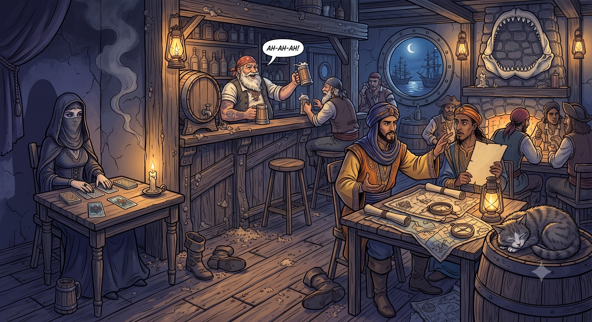

# 🍺 ScummBar AI — A Collaborative Multi-Agent Study Project



> *"Where sabers rest, stories float, and agents run the bar."*

Welcome to the **Scummbar AI**! This is an open-source, hands-on **study repository** designed to teach developers how to build, orchestrate, and maintain a complex, multi-agent conversational application using **Google Agent Development Kit (ADK)**, Gemini, and DeepSeek, integrated directly into **Telegram** and **REST APIs**.

Instead of a dry reference manual, this documentation is structured **didactically** to guide you through the architectural decisions, the code design, and the modern AI-assisted workflows used to build and evolve this project.

---

## 🗺️ Table of Contents
1. [📖 The Story & The Characters](#-the-story--the-characters)
2. [🚀 Quick Start (Run First, Learn Later)](#-quick-start-run-first-learn-later)
3. [🏗️ Architectural Blueprint & Technical Choices (ADK + Telegram)](#️-architectural-blueprint--technical-choices-adk--telegram)
   - [3.1 Component & File Dependency Map (Telegram + Core ADK)](#31-component--file-dependency-map-telegram--core-adk)
   - [3.2 Collaborative Multi-Agent Coordination](#32-collaborative-multi-agent-coordination)
   - [3.3 Core Architectural Choices](#33-core-architectural-choices)
4. [🤖 AI-Assisted Development: The Pi-Agent Autopilot](#-ai-assisted-development-the-pi-agent-autopilot)

---

## 📖 The Story & The Characters

The **Scummbar** is a legendary Caribbean pirate tavern. It is a shared multi-agent environment where AI-powered characters live, listen, and interact with patrons in real-time.

| Character | Role | Didactic Purpose | Personality Vibe |
|-----------|------|------------------|------------------|
| 🍺 **Barnaby** | Bartender | Demonstrates **Tool Calling** (Memory Read/Write, Text Artifact generation) and ADK **Skills Auto-Discovery** | Empathetic, quiet, knows every pirate's secret, mixes unforgettable custom grogs. |
| 🐱 **Barnacle** | Tavern Cat | Demonstrates **Read-Only Shared Memory** and **Ephemeral Telegram Messaging** (whispering to specific users) | Crotchety, speaks rarely, sleeps on ammo crates, dislikes loud patrons. |
| 🔮 **Isolde** | Fortune Teller | Demonstrates **Independent Multi-Auth Routing** and **Multimodal Image Generation** (native Gemini 3.1 Flash Image + Pillow PIL fallback) | Cryptic, majestic, sits in the Shadow Corner, extracts mystical tarot cards. |
| 🧭 **Balthazar** | Navigator & Cartographer | Demonstrates **Live RSS Feed Fetching & Pompous Comedic Translation**, **Sub-Agent Delegation**, and **Text Artifact Generation** (Portolans & Charts) | Eccentric, theatrically solemn, turns political bickering and tech news into epic maritime-fantasy lore with unintentional hilarity. |

---

## 🚀 Quick Start (Run First, Learn Later)

Follow these steps to get the Scummbar running on your local machine, Web UI, or Telegram group in minutes.

### 1. Prerequisites
- Python 3.11+
- **Astral `uv`** (pre-installed on system: `brew install uv` or `curl -LsSf https://astral.sh/uv/install.sh`)
- A Google Gemini API Key (from [Google AI Studio](https://aistudio.google.com/)) OR a Google Cloud Service Account (Vertex AI).
- A Telegram Bot Token from [@BotFather](https://t.me/botfather) (optional, for Telegram delivery).

### 2. Installation
```bash
# Clone the repository
git clone https://github.com/goldfix/ScummBarAI.git
cd ScummBarAI

# Initialize and create the virtual environment
source py_env.sh init_py

# Activate the environment
source py-env/bin/activate  # or: source py_env.sh active
```

### 3. Environment Configuration
Copy `.env.example` or create a file named `src/scummbar_chat/.env`. This file is divided into **6 logical sections** based on purpose:

```env
# ===========================================================================
# 🔐 SECTION 1: CORE GEMINI AUTHENTICATION (Chat & Compaction Auth)
# ===========================================================================
# Choose ONE of the two options (A or B) and comment out the other.

# --- OPTION A: Google AI Studio (API Key) — Simple, no GCP project needed ---
GEMINI_API_KEY=your-api-key-here

# --- OPTION B: Vertex AI / Google Cloud (Service Account) — GCP Enterprise ---
# GOOGLE_CLOUD_PROJECT=your-gcp-project-id
# GOOGLE_CLOUD_LOCATION=global
# GOOGLE_GENAI_USE_VERTEXAI=True
# GOOGLE_APPLICATION_CREDENTIALS=/absolute/path/to/key.json

# ===========================================================================
# 💬 SECTION 2: CHAT CONVERSATION (Core LLM Settings)
# ===========================================================================
# The main model used by the bots for chatting.
# You can easily switch to DeepSeek by using the "deepseek/" prefix.

# --- Example 1: Google Gemini (uses Section 1 Auth) ---
LLM_MODEL=gemini-3.6-flash
LLM_THINKING_LEVEL=medium

# --- Example 2: DeepSeek (requires Section 5 Auth) ---
# LLM_MODEL=deepseek/deepseek-v4-flash

# ===========================================================================
# 🗜️ SECTION 3: CONTEXT COMPACTION (Compression Settings)
# ===========================================================================
# Summarization settings (can also use DeepSeek models).
COMPACTION_MODEL=gemini-3.5-flash-lite
COMPACTION_INTERVAL=30
COMPACTION_OVERLAP=2

# ===========================================================================
# 💾 SECTION 3b: EXPLICIT CONTEXT CACHING (Gemini only, ADK 2.6+)
# ===========================================================================
# Explicit App-level caching (ContextCacheConfig). Requires Gemini 2.0+.
# Automatically skipped for DeepSeek (server-side KV caching is automatic).
CONTEXT_CACHE_ENABLED=true
CONTEXT_CACHE_MIN_TOKENS=2048
CONTEXT_CACHE_TTL_SECONDS=600
CONTEXT_CACHE_INTERVALS=5

# ===========================================================================
# 🔮 SECTION 4: IMAGE GENERATION (Isolde Settings & INDEPENDENT AUTH)
# ===========================================================================
# Isolde's Tarot model and its FULLY INDEPENDENT, isolated authentication.
IMAGE_MODEL=gemini-3.1-flash-lite-image

# --- OPTION A: Google AI Studio (Dedicated API Key for Images) ---
IMAGE_GEMINI_API_KEY=your-dedicated-image-api-key-here

# --- OPTION B: Vertex AI / Google Cloud (Dedicated Service Account for Images) ---
# IMAGE_GOOGLE_CLOUD_PROJECT=another-gcp-project-id
# IMAGE_GOOGLE_CLOUD_LOCATION=europe-west1
# IMAGE_GOOGLE_GENAI_USE_VERTEXAI=True
# IMAGE_GOOGLE_APPLICATION_CREDENTIALS=/absolute/path/to/another-key.json

# ===========================================================================
# 🧠 SECTION 5: DEEPSEEK PROVIDER OVERRIDES (Optional)
# ===========================================================================
DEEPSEEK_API_KEY=your-deepseek-api-key-here
DEEPSEEK_REASONING_EFFORT=high

# ===========================================================================
# 📡 SECTION 6: TELEGRAM INTEGRATION (Optional)
# ===========================================================================
TELEGRAM_BOT_TOKEN=your-telegram-bot-token
TELEGRAM_BOT_USERNAME=your_bot_username
TELEGRAM_GROUP_LINK=https://t.me/your-group-link
```

### 4. Running the Applications

#### Option A: Google ADK Web Interface
```bash
./start.sh  # Launches Google ADK Web with persistent SQLite session tracking
```
Open `http://localhost:8000` to chat with the ADK coordinator.

#### Option B: Telegram Bot (Group Delivery)
```bash
python telegram_bot.py --debug
```

---

## 🏗️ Architectural Blueprint & Technical Choices (ADK + Telegram)

The Scummbar ADK application (`src/scummbar_chat/`) is designed around clean software engineering and multi-agent patterns. Here is how the system is organized:

### 3.1 Component & File Dependency Map (Telegram + Core ADK)

The following diagram illustrates the import hierarchy and data flow between the Telegram delivery layer, the Google ADK runtime, and the core agent logic:

```
                          ┌────────────────────────────────┐
                          │       telegram_bot.py          │ (CLI Process Supervisor)
                          └───────────────┬────────────────┘
                                          │ imports
                                          ▼
                          ┌────────────────────────────────┐
                          │   telegram/adapter.py          │ (Polling, Semantic Router,
                          └───────┬──────────────┬─────────┘  Locks, System Prompt Injections)
                     imports      │              │ imports
         ┌────────────────────────┘              └────────────────────────┐
         ▼                                                                ▼
┌──────────────────┐                                            ┌──────────────────┐
│telegram/formatter│                                            │telegram/runner.py│ (ADK App & Session Runner,
└──────────────────┘                                            └────────┬─────────┘  Compaction, Context Cache)
                                                                         │ imports
                                                                         ▼
                                                                ┌──────────────────┐
                                                                │     agent.py     │ (Root Coordinator &
                                                                └──┬─────────────┬─┘  InstructionProvider)
                                                imports sub-agents │             │ imports
                                 ┌─────────────────────────────────┘             └──────────────────┐
                                 ▼                                                                  ▼
              ┌──────────────────────────────────────┐                                   ┌────────────────────┐
              │              bots/                   │                                   │  time_context.py   │ (Real-Time Atmosphere)
              │ (barnaby, barnacle, isolde, balthazar)│                                   └────────────────────┘
              └──────────────────┬───────────────────┘
                                 │ imports tools & utils
                                 ▼
              ┌──────────────────────────────────────┐               ┌────────────────────────────────────────┐
              │               tools.py               ├──────────────►│               utils.py                 │ (Model Factory, Dual Auth,
              │ (Memory, Scrolls, Tarot, RSS Feed)   │  imports      │ (Config, Dual Auth, Skills Loader, MD) │  Skills & MD Loader)
              └──────────────────────────────────────┘               └──────────────────┬─────────────────────┘
                                                                                        │ loads
                                                                                        ▼
                                                                     ┌────────────────────────────────────────┐
                                                                     │    world/scummbar.md & skills/         │ (World Prompt & Skills)
                                                                     └────────────────────────────────────────┘
```

#### A. Telegram Delivery Layer (`telegram_bot.py` & `src/scummbar_chat/telegram/`)

*   **`telegram_bot.py` (CLI Supervisor)**:
    *   *Role*: Top-level executable script for running Scummbar in Telegram mode.
    *   *How it works*: Performs pre-flight environment checks (`_check_env()`), validates Google Service Account JSON keys or API keys at boot, configures rotating log files (`data/scummbar_chat/logs/bot.log` and `errors.log`), traps lifecycle signals (`SIGINT`, `SIGTERM`), logs uncaught traceback dumps, and hands execution over to `adapter.main()`.
*   **`src/scummbar_chat/telegram/adapter.py` (API Adapter & Event Loop)**:
    *   *Role*: Asynchronous long-polling engine communicating directly with the Telegram Bot API via `aiohttp`.
    *   *How it works*: Receives raw updates, redirects private DM messages in-character to the public group link, resolves intent via `@mention` priority or keyword matching (`_INTENT_MAP`), manages per-bot concurrency locks (`asyncio.Lock` with a 15s busy timeout), injects Narratore environment prompts every 3 messages, executes ADK turns via `runner.run_agent()`, captures `artifact_delta` streams to upload downloadable `.txt` documents or tarot photos, handles ephemeral whispers for Barnacle, and schedules the hourly background session-pruning cron job.
*   **`src/scummbar_chat/telegram/formatter.py` (HTML Output Formatter)**:
    *   *Role*: Text transformation and HTML escaper for Telegram API delivery.
    *   *How it works*: Takes raw markdown or plain text responses from ADK agents and converts them into Telegram-safe HTML (`format_response()`). Implements a 3-tier parsing scheme: standard dialogue text, character physical action asterisks (`*action*` → `<i>action</i>`), and ambient narration underscores (`_line_` → `<blockquote><i>line</i></blockquote>`), escaping reserved HTML entities (`<`, `>`, `&`).
*   **`src/scummbar_chat/telegram/runner.py` (ADK Session Runtime & Compaction)**:
    *   *Role*: Google ADK `App` and `Runner` initialization and state orchestrator.
    *   *How it works*: Wraps `root_agent` into an ADK `App`. Configures persistent SQLite session storage (`DatabaseSessionService` pointing to `data/scummbar_chat/sessions.db`), configures automated LLM-based event compaction (`EventsCompactionConfig` + `LlmEventSummarizer`), attaches explicit Gemini context caching (`ContextCacheConfig`), and initializes `InMemoryArtifactService` for secret scrolls and portolans. Exposes `run_agent()` and `purge_old_sessions()` (24-hour event retention cleanup).

#### B. Core ADK Agent & Business Logic Layer (`src/scummbar_chat/`)

*   **`src/scummbar_chat/agent.py` (Root Coordinator & Dynamic Instruction)**:
    *   *Role*: ADK Root Agent (`root_agent`) definition and global instruction provider.
    *   *How it works*: Instantiates the central `root_agent` (`LlmAgent`). Binds `_world_instruction_provider()`, an ADK `InstructionProvider` function that re-reads `world/scummbar.md` and evaluates real-time Caribbean tavern atmosphere from `time_context.py` at every single model turn. Registers sub-agents (`barnaby`, `barnacle`, `isolde`, `balthazar`) and attaches `DEFAULT_RETRY_CONFIG` for API call resilience.
*   **`src/scummbar_chat/utils.py` (Central Factory, Dual Auth & Toolset Discovery)**:
    *   *Role*: Application configuration, LLM model factory, credential isolation, and skill loader.
    *   *How it works*: Loads `.env` environment variables. Implements `get_gemini_client_kwargs()` to parameterize authentication between Google AI Studio API Keys and Vertex AI Service Accounts without environment pollution, isolating image generation auth (`IMAGE_*`) independently. Implements `_build_model_instance()` to construct `Gemini` or `LiteLlm` (DeepSeek with thinking mode & reasoning effort) instances. Exposes `load_md()` for prompt files and `load_all_skills()` for scanning and instantiating ADK `SkillToolset` packages.
*   **`src/scummbar_chat/tools.py` (ADK Function Tools)**:
    *   *Role*: Callable function tools for agents (Memory, Media Generation, RSS Feeds).
    *   *How it works*:
        1.  `recall_patron_memory` / `memorize_patron_chat`: Reads/writes patron profile memories in SQLite `patron_memories`, retrieving real Telegram IDs safely via `ToolContext.user_id`.
        2.  `write_secret_scroll`: Generates recipe, tarot reading, or nautical portolan text files into ADK `InMemoryArtifactService`.
        3.  `draw_tarot_card`: Multimodal image generation tool invoking `gemini-3.1-flash-lite-image` with isolated auth (`IMAGE_*`) or PIL fallback.
        4.  `fetch_news_feed`: Live RSS reader (ANSA, HDBlog) for Balthazar's news translation.
*   **`src/scummbar_chat/time_context.py` (Real-Time Atmosphere Engine)**:
    *   *Role*: Real-world clock mapping to tavern atmosphere.
    *   *How it works*: Maps system UTC/local time into 6 Caribbean time periods (Dawn, Morning, Noon, Afternoon, Sunset, Night), returning evocative ambient descriptions for `_world_instruction_provider()`.
*   **`src/scummbar_chat/world/scummbar.md` (Master World Prompt)**:
    *   *Role*: Markdown prompt source for the tavern environment.
    *   *How it works*: Defines tavern geography, ambient rules, NPC relationships, and strict Narratore injection guidelines.
*   **`src/scummbar_chat/bots/` (Individual Agent Personas)**:
    *   *Role*: Individual agent persona prompts and module wrappers.
    *   *How it works*: Contains `agent.py` + `persona.md` for each bot (`barnaby`, `barnacle`, `isolde`, `balthazar`). Defines persona-specific instructions and mounts required tools/skills.
*   **`src/scummbar_chat/skills/` (Auto-Discovered ADK Skills)**:
    *   *Role*: Modular, folder-based capabilities (`grog/`, `menu/`).
    *   *How it works*: Standard ADK skill folders containing `SKILL.md` frontmatter and instructions. Auto-discovered at startup by `utils.load_all_skills()` and mounted to Barnaby.

---

### 3.2 Collaborative Multi-Agent Coordination
Instead of a single monolith prompt, the Scummbar uses a **Hierarchical Router-Delegate** pattern using Google ADK's `root_agent` and `sub_agents`.

```
                    [Telegram / Web Input]
                              │
                              ▼
                        [root_agent]
                    (Shared Coordinator)
                              │
         ┌────────────────────┼────────────────────┬────────────────────┐
         ▼                    ▼                    ▼                    ▼
    [Barnaby]             [Barnacle]            [Isolde]           [Balthazar]
 (The Bartender)         (The Tavern Cat)    (The Fortune Teller)  (The Navigator)
  - Memory read/write     - Read-only Memory   - Independent Auth    - RSS Feed Fetching
  - Auto-discovered       - Ephemeral replies  - Gemini Nano Image   - Comedic News
    Skills (Grog/Menu)                           generation tool       Translation
```

*   **How routing works**: In `src/scummbar_chat/telegram/adapter.py`, the function `_resolve_intent()` applies two priority levels:
    1.  **Explicit Mention**: `@barnaby`, `@barnacle`, `@isolde`, `@balthazar` (always wins).
    2.  **Semantic Keyword Matching**: The message is scanned against `_INTENT_MAP` (e.g., `grog` routes to Barnaby, `tarocchi` or `carte` to Isolde, `politica` or `mappe` to Balthazar).
*   **Routing Prefix**: Once resolved, the router prepends `[Risponde NAME]` to the text, which instructs the coordinator (`root_agent`) to route the call to the corresponding sub-agent.

### 3.3 Core Architectural Choices

#### A. Centralized Temporal World Context (InstructionProvider)
To create an immersive atmosphere, the bar never closes but changes its mood in real-time. In `src/scummbar_chat/time_context.py`, the day is split into 6 periods (Dawn, Noon, Sunset, Night, etc.).
*   **The Choice**: Instead of passing the world description statically, we use ADK's `global_instruction` bound to an **`InstructionProvider`** function. This dynamically updates the bar's description *at every model turn* based on the actual system hour.
*   **Why**: This is cache-friendly for Gemini and ensures the agents always know if it's sunset or dawn without manual prompt editing.

#### B. SQLite Session Persistence & Database Compaction
All group chats are mapped to a single persistent SQLite database (`data/scummbar_chat/sessions.db`) via ADK's `DatabaseSessionService`.
*   **Context Compaction**: As history grows, the context window fills up. We configured an automated, LLM-based compaction scheme (`EventsCompactionConfig` + `LlmEventSummarizer`):
    *   After every **30 events**, the older portion of the conversation is replaced by an LLM-generated summary (`COMPACTION_MODEL`).
    *   The last **2 events** are kept verbatim to maintain immediate conversational context.

#### C. Smart Dual-Authentication & Isolation
One of the key technical highlights of this repository is how authentication is parameterized:
*   **The Problem**: The standard Google GenAI SDK throws a fatal error if you supply both an API Key and Vertex AI variables globally in the environment (they are mutually exclusive).
*   **The Solution**: We built `get_gemini_client_kwargs(prefix="")` in `utils.py`.
    *   If `GEMINI_API_KEY` is present, it forces `vertexai=False` and programmatically overrides `project=None` and `location=None`, shielding the client from environment pollution.
    *   If `prefix="IMAGE_"` is specified, it isolates the **Image Generation** auth entirely, allowing Isolde to run on a separate billing project, key, or Vertex regional project without affecting Chat/Compaction!
    *   **Thread Safety**: For Vertex AI Service Accounts, we load the JSON directly as an in-memory `Credentials` object rather than mutating `os.environ` globally, ensuring perfect safety during async concurrent loops.

#### D. Tangible Media Delivery (Artifacts)
We wanted the agents to be able to "hand over" items to players:
*   **Barnaby & Balthazar's Scrolls & Portolans**: Generates recipes, nautical maps, and portolans as `.txt` files using ADK's `InMemoryArtifactService` via the `write_secret_scroll` tool. Delivered as downloadable Telegram documents.
*   **Isolde's Tarot Images**: Uses `draw_tarot_card` tool via Gemini's native `response_modalities=["IMAGE"]` or a customized **Pillow (PIL) local rendering fallback** if the API is offline. Automatically detects the file format (PNG vs. JPEG) via byte headers and delivers it as an inline native photo via `/sendPhoto`.

#### E. Multi-Model Support (Gemini & DeepSeek)
The Scummbar is designed to be model-agnostic. You can switch the brain of the tavern simply by changing one line in the `.env` file (`LLM_MODEL`).
*   **Gemini Support**: Native ADK support for the `gemini-3.6`, `gemini-3.5`, and `gemini-3.1` families.
*   **DeepSeek Support**: Fully integrated using ADK's `LiteLlm` adapter. The `utils.py` factory automatically detects the `"deepseek/"` prefix in the model name, enables DeepSeek's `thinking` mode, and sets the `reasoning_effort` natively without requiring any code changes.

---

## 🤖 AI-Assisted Development: The Pi-Agent Autopilot

This repository was designed to be developed, refactored, and maintained **collaboratively with an AI coding assistant (Pi-Agent)**.

To achieve this, we configured a specialized autonomous system directly in the codebase using **Agent Skills**.

```
                                    [.agents/skills/]
                                            │
          ┌─────────────────────────────────┼─────────────────────────────────┐
          ▼                                 ▼                                 ▼
[scummbar-docs-analyzer]        [scummbar-memory-updater]       [scummbar-web-to-markdown]
  - Hybrid RAG engine              - Automated logging rules       - HTML/Web to Markdown
    (FTS5 BM25 + Vector)           - Roadmap state compiler          converter & updater
  - gemini-embedding-2             - Fence marker validator        - BS4 + html2text pipeline
  - Reciprocal Rank Fusion
```

### 1. What is an Agent Skill?
A Pi-Agent skill is a self-contained, capability package located in `.agents/skills/`. At startup, Pi-Agent scans this directory and learns about the available capabilities via the skill's description. The full instructions are kept separate and loaded **on-demand** when the skill is called.

This implements **Progressive Disclosure**: it keeps the AI's initial context window incredibly clean, saving tokens, speeding up response times, and maximizing the LLM's reasoning focus.

### 2. Our Customized Skills

#### A. Documentation Analyzer & RAG Engine (`/skill:scummbar-docs-analyzer`)
-   **Why**: The `docs/` folder contains dozens of framework guides. Storing their indexes in the main developer instructions (`AGENTS.md` or `MEMORY.md`) wasted thousands of tokens. Plain `rg`/`grep` searches can't capture semantic intent.
-   **What it does**: This skill provides a **local Hybrid RAG Search Engine** (`rag/`) that chunks all 860 Markdown documents (14,728 chunks), generates embeddings via Google `gemini-embedding-2`, stores vectors in SQLite (`sqlite-vec`), and performs hybrid search using **Reciprocal Rank Fusion (RRF)** between FTS5 keyword matching (BM25) and Vector Cosine Similarity — no manual index needed.
-   **How to use**:
    ```bash
    # Semantic + keyword search (returns ranked chunk results)
    PYTHONPATH=.agents/skills/scummbar-docs-analyzer python3 .agents/skills/scummbar-docs-analyzer/rag/search.py "context compaction" --top_k 5

    # Incremental re-indexing after adding new docs
    PYTHONPATH=.agents/skills/scummbar-docs-analyzer python3 .agents/skills/scummbar-docs-analyzer/rag/indexer.py
    ```

#### B. Memory & Documentation Updater (`/skill:scummbar-memory-updater`)
-   **Why**: Keeping architectural decisions (`MEMORY.md`), developer guides (`AGENTS.md`), and public manuals (`README.md`) synchronized across dozens of commits is extremely error-prone for humans and AIs alike.
-   **What it does**: Standardizes how the AI must document changes. It enforces rules on how to append session logs, update the roadmap, register design decisions, and includes an automated Python validator to ensure no markdown code blocks are left open or broken.

#### C. Web-to-Markdown Converter (`/skill:scummbar-web-to-markdown`)
-   **Why**: Importing external technical documentation or web guides into clean Markdown format for the offline `docs/` repository can be tedious and prone to formatting issues.
-   **What it does**: Automatically converts web pages or URL lists into clean, standardized Markdown files using `beautifulsoup4` and `html2text`. Supports auto-updates, relative-to-absolute link resolution, UTF-8 emoji preservation, and file overwrite protection. After conversion, automatically triggers the RAG incremental indexer to update the vector database.

### 3. How to Use the Autopilot (For Developers)
If you are developing this repository using Pi-Agent, you can invoke these skills or execute their CLI tools directly:

```bash
# 1. Search framework documentation across 443 docs using Hybrid RAG (FTS5 + Cosine)
PYTHONPATH=.agents/skills/scummbar-docs-analyzer python3 .agents/skills/scummbar-docs-analyzer/rag/search.py "agent evaluation custom metrics" --top_k 5

# 2. Convert a web page to clean Markdown and auto-index into the RAG vector database
python3 .agents/skills/scummbar-web-to-markdown/scripts/convert.py "https://adk.dev/evaluate/" "docs/google-api/"
PYTHONPATH=.agents/skills/scummbar-docs-analyzer python3 .agents/skills/scummbar-docs-analyzer/rag/indexer.py

# 3. Update memory, roadmap, and check markdown fence health after refactoring
/skill:scummbar-memory-updater
```

By combining Google ADK and Pi-Agent Skills for autonomous workspace organization, this repository stands as a **state-of-the-art template for modern, AI-collaborative software engineering**.

---

*Inspired by the Scumm Bar from Monkey Island. Built for learning and study purposes. No commercial affiliation.*
